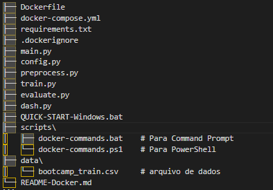
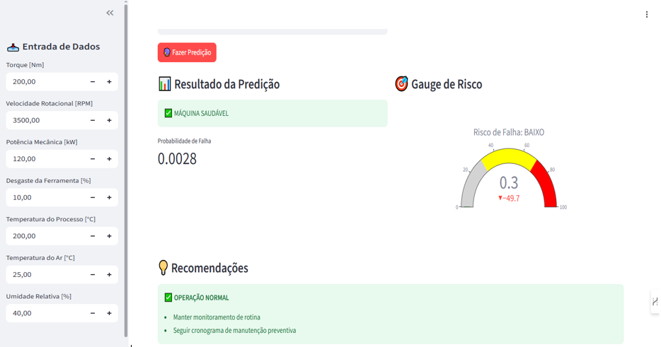
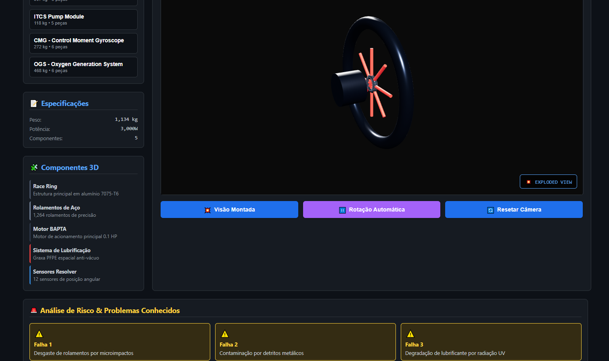

# AMIA: Manutenção Inteligente e Assistida para a ISS

<p align="center">
  
</p>

**Integração de Inteligência Artificial e Realidade Aumentada para Análise Preditiva e Assistência em Manutenção de Componentes Críticos da Estação Espacial Internacional (ISS).**

---

##  Sobre o Projeto

Este projeto propõe uma **arquitetura inovadora e de alto impacto** para a manutenção preditiva e assistida na Estação Espacial Internacional (ISS). A solução, denominada **AMIA (Assistência e Manutenção Inteligente e Aumentada)**, combina o poder da **Inteligência Artificial (IA)** para a previsão de falhas com a imersão da **Realidade Aumentada (RA)** para a execução precisa de procedimentos de manutenção.

### Objetivos Estratégicos

O AMIA foi desenvolvido para enfrentar os desafios críticos da manutenção espacial, visando:

- **Previsão de Falhas:** Desenvolver modelos de IA robustos para análise preditiva em componentes críticos.
- **Assistência Operacional:** Implementar uma interface de RA intuitiva para treinamento e execução de manutenção em tempo real.
- **Otimização de Missão:** **Reduzir drasticamente o tempo de inatividade** de equipamentos e **minimizar o erro humano** em ambientes de alto estresse e microgravidade.

---

##  Arquitetura do Sistema

A solução é composta por três módulos principais, projetados para operar de forma integrada e autônoma.

### 1. Módulo de IA Preditiva

Responsável por analisar dados de telemetria e prever a degradação de componentes.

| Característica | Detalhe |
| :--- | :--- |
| **Dataset** | AI4I 2020 Predictive Maintenance Dataset (Simulação de falhas) |
| **Algoritmos** | Decision Tree, Bagging Classifier, **Random Forest** (Modelo de Produção) |
| **Métricas-Chave** | Previsão de RUL (Remaining Useful Life), Pontuação de Risco |
| **Desempenho** | AUC 1.00, F1-Score 0.98 (Random Forest) |

### 2. Módulo de Realidade Aumentada (RA)

Fornece orientação visual e contextualizada para os astronautas durante os procedimentos.

- **Dispositivo de Referência:** Microsoft HoloLens
- **Funcionalidades:**
    - **Rastreamento de Alta Precisão** por visão computacional.
    - **Sobreposição de Instruções** passo a passo diretamente no componente.
    - **Visualização em Tempo Real** de dados preditivos (RUL, Risco) no campo de visão.
    - **Guias de Procedimento** assistido para manutenção complexa.

### 3. Integração Orbital e Edge Computing

Garante a operacionalidade e a baixa latência do sistema no ambiente espacial.

- **Processamento:** **Edge Computing** com hardware *rad-hard* (resistente à radiação) para inferência local.
- **Protocolos:** Compatibilidade com padrões de comunicação espacial (MIL-STD-1553, CCSDS).
- **Latência:** Inferência determinística e de baixa latência (< 100ms) para ações críticas.

---

##  Resultados e Performance

### Desempenho dos Modelos de IA

A escolha do modelo **Random Forest** foi validada por sua performance superior e robustez, essencial para aplicações de missão crítica.

| Modelo | Acurácia | AUC | F1-Score | Robustez |
| :--- | :--- | :--- | :--- | :--- |
| Decision Tree | 96.5% | 0.96 | 0.92 | Baixa |
| Bagging Classifier | 97.8% | 0.99 | 0.96 | Média |
| **Random Forest** | **98.1%** | **1.00** | **0.98** | **Alta** |

### Impacto Operacional Comprovado da RA

O uso da Realidade Aumentada é suportado por estudos que demonstram seu potencial transformador na manutenção.

| Métrica | Melhoria Esperada | Fonte |
| :--- | :--- | :--- |
| Tempo de Execução | **25% a 40%** de redução | [Maintwiz 2024] |
| Taxa de Erro Humano | **50% a 80%** de minimização | [IEEE 2024] |
| Retenção de Treinamento | **15% a 30%** de aumento | [IJIRCCE 2023] |

---

##  Casos de Uso e Fluxo Operacional

### Exemplo: Manutenção em Control Moment Gyros (CMGs)

Os CMGs são cruciais para o controle de atitude da ISS.

| Etapa | Descrição |
| :--- | :--- |
| **Problema** | Degradação de mancais em vácuo, levando à falha catastrófica. |
| **IA Detecta** | Aumento de torque residual e assimetrias de vibração (T-72h). |
| **RA Orienta** | Projeta o procedimento de substituição, destacando parafusos e exibindo o torque exato necessário. |
| **Resultado** | Reparo preciso, com **redução de 40% no tempo** e garantia de conformidade. |

### Fluxo Operacional Típico do AMIA

1.  **Fase 1: Detecção (T-72h)** → O Módulo de IA identifica uma anomalia e prevê a falha.
2.  **Fase 2: Intervenção (T-24h)** → O sistema gera uma ordem de serviço digital e o guia de RA correspondente.
3.  **Fase 3: Execução** → O astronauta é guiado pelo sistema de RA, passo a passo.
4.  **Fase 4: Validação** → A IA confirma a normalização dos parâmetros e o sucesso da manutenção.

---

##  Guia de Execução e Instalação

Este guia detalha como configurar e executar o pipeline de Machine Learning e o Dashboard de visualização.

### Estrutura do Projeto

O código foi organizado de forma **modular** para garantir clareza, escalabilidade e fácil manutenção.

```
amia-iss/
├── data/
│   ├── raw/                 # Dados brutos de telemetria
│   ├── processed/           # Dados pré-processados
│   └── models/              # Modelos treinados
├── src/
│   ├── prediction/          # Módulos de IA preditiva
│   ├── ar_interface/        # Sistema de realidade aumentada (Simulação)
│   ├── integration/         # Integração com sistemas ISS (Simulação)
│   └── utils/               # Utilitários comuns
├── docs/                    # Documentação técnica
├── tests/                   # Testes unitários e integração
└── Iss-Visualizador/        # Ambientes de simulação e visualização
```

<p align="center">
  
</p>

###  Pré-requisitos

- Python **3.9 ou superior**
- `pip` (gerenciador de pacotes do Python)
- **Para o Módulo RA (Simulação):** Unity 2022.3+, TensorFlow 2.8+, OpenCV 4.5+

###  Instalação

1.  **Clonar o Repositório:**
    ```bash
    git clone https://github.com/LeonardoCorreia08/HBR.git amia-iss
    cd amia-iss
    ```

2.  **Criar e Ativar o Ambiente Virtual (Recomendado):**
    ```bash
    python -m venv venv
    # Linux/macOS
    source venv/bin/activate
    # Windows
    .\venv\Scripts\activate
    ```

3.  **Instalar as Dependências:**
    O arquivo `requirements.txt` contém todas as bibliotecas necessárias para os módulos de IA e Dashboard.
    ```bash
    pip install -r requirements.txt
    ```

###  Execução do Pipeline de IA

O script `main.py` orquestra o pipeline completo de Machine Learning (Configuração → Pré-processamento → Treino → Avaliação → Salvamento).

```bash
python main.py
```

###  Execução do Dashboard Streamlit

Visualize e interaja com o modelo de Manutenção Preditiva.

1.  **Execute o Streamlit:**
    ```bash
    streamlit run app.py
    ```
2.  **Acesse no Navegador:**
    O dashboard estará disponível em `http://localhost:8501`.

<p align="center">
  
</p>

###  Outras Execuções

- **Execução da API de Avaliação:**
    ```bash
    python dash.py
    ```
- **Execução da Simulação de RA:**
    ```bash
    python src/ar_interface/simulate_ar.py
    ```

---

##  Visualização e Recursos Adicionais

- **Visualizador do Ambiente ISS:** [Acesse o Projeto](https://iss-visualizador.vercel.app/)
- **Análise Exploratória de Dados (EDA):** [Acesse o Relatório](https://github.com/LeonardoCorreia08/HBR/blob/main/resultado/Analise.md)
- **Relatório Técnico Completo:** [Acesse o HTML](https://github.com/LeonardoCorreia08/Bootcamp_US/blob/main/relatorio_manutencao_preditiva.html)

<p align="center"></p>
<p align="center"></p>

---

##  Tecnologias Utilizadas

| Categoria | Tecnologias |
| :--- | :--- |
| **Linguagem** | Python |
| **Data Science** | Pandas, Numpy, Scikit-learn, Imbalanced-learn |
| **Visualização** | Matplotlib, Seaborn, Ydata-profiling |
| **APIs e Deploy** | FastAPI, Uvicorn, Docker |
| **Dashboard** | Streamlit |
| **RA (Simulação)** | Unity, TensorFlow, OpenCV, A-Frame 1.4.2, AR.js 3.4.5, Three.js, JavaScript ES6 |
| **Automação** | GitHub Actions |

---

##  Contribuição

Interessado em contribuir? Entre em contato com o autor para discutir oportunidades de colaboração.

## Licença

Este projeto está licenciado sob a **Licença MIT** - veja o arquivo `LICENSE` para detalhes.
