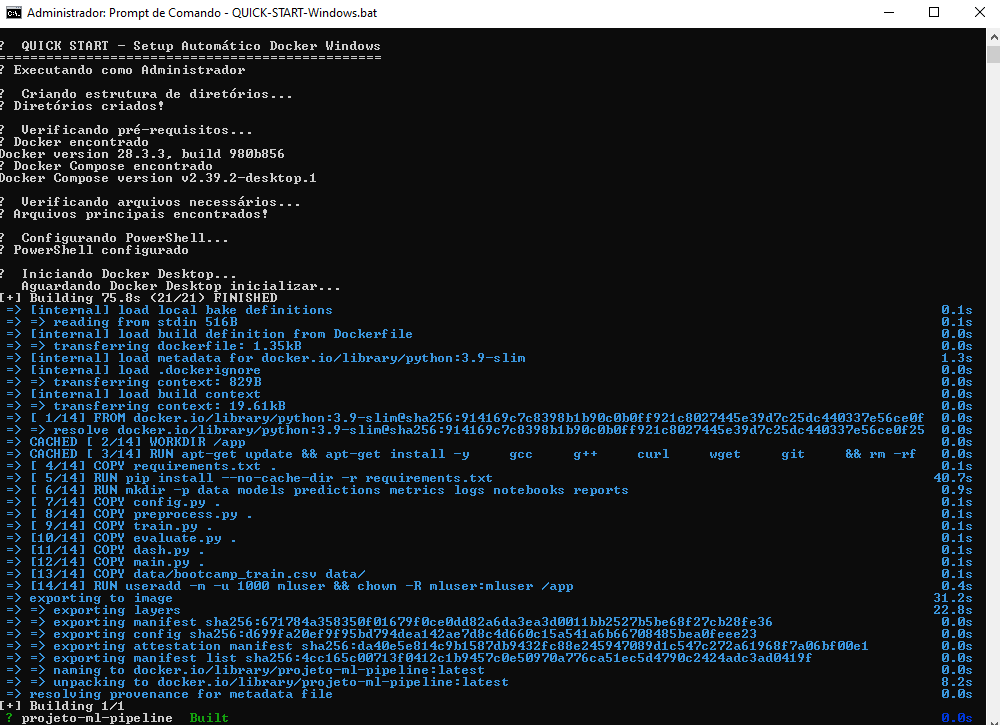

<p align="center">
  
</p>

# AMIA: Manutenção Inteligente e Assistida para a ISS

Integração de Inteligência Artificial e Realidade Aumentada para Análise Preditiva e Treinamento em Manutenção de Componentes da Estação Espacial Internacional.

## Sobre o Projeto

Este projeto propõe uma arquitetura inovadora para manutenção preditiva e assistida na Estação Espacial Internacional (ISS), combinando **Inteligência Artificial (IA)** para previsão de falhas com **Realidade Aumentada (RA)** para execução de procedimentos de manutenção.

### Objetivos Principais

- **Desenvolver modelos de IA** para análise preditiva de falhas em componentes críticos
- **Implementar interface de RA** para treinamento e execução de manutenção
- **Reduzir tempo de inatividade** e **minimizar erro humano** em ambientes de alto estresse

## Arquitetura do Sistema

### Componentes Principais

#### 1. Módulo de IA Preditiva
- **Dataset**: AI4I 2020 Predictive Maintenance Dataset
- **Algoritmos**: Decision Tree, Bagging Classifier, Random Forest
- **Métricas**: Previsão de RUL (Remaining Useful Life), Pontuação de Risco
- **Desempenho**: AUC 1.00, F1-Score 0.98 (Random Forest)

#### 2. Módulo de Realidade Aumentada
- **Dispositivos**: Microsoft HoloLens
- **Funcionalidades**:
  - Rastreamento por visão computacional
  - Sobrepõe instruções passo a passo
  - Visualização de dados preditivos em tempo real
  - Guias de procedimento assistido

#### 3. Integração Orbital
- **Processamento**: Edge computing com hardware rad-hard
- **Protocolos**: Compatibilidade com MIL-STD-1553, CCSDS
- **Latência**: Inferência determinística para manutenção crítica

## Resultados e Performance

### Desempenho dos Modelos de IA

| Modelo | Acurácia | AUC | F1-Score | Robustez |
|--------|----------|-----|----------|----------|
| Decision Tree | 96.5% | 0.96 | 0.92 | Baixa |
| Bagging Classifier | 97.8% | 0.99 | 0.96 | Média |
| **Random Forest** | **98.1%** | **1.00** | **0.98** | **Alta** |

### Impacto Esperado da RA

| Métrica | Melhoria Esperada | Fonte |
|---------|-------------------|-------|
| Tempo de Execução | 25-40% | [Maintwiz 2024] |
| Taxa de Erro Humano | 50-80% | [IEEE 2024] |
| Retenção de Treinamento | 15-30% | [IJIRCCE 2023] |

## Casos de Uso

### Manutenção em Control Moment Gyros (CMGs)

**Problema**: Degradação de mancais em vácuo
**Solução AMIA**:
1. **IA detecta**: Aumento de torque residual, assimetrias de vibração
2. **RA orienta**: Destaca parafusos específicos, exibe torque necessário
3. **Resultado**: Reparo preciso com redução de 40% no tempo

### Fluxo Operacional Típico
Fase 1: Detecção (T-72h) → IA identifica anomalia
Fase 2: Intervenção (T-24h) → Sistema gera ordem de serviço
Fase 3: Execução → RA guia reparo passo a passo
Fase 4: Validação → IA confirma normalização dos parâmetros


##  Implementação Técnica

## 📂 Estrutura do Projeto

O código foi organizado de forma **modular**, garantindo clareza, escalabilidade e fácil manutenção.


---

# 🔧Ferramenta

## Como Executar o Projeto

Siga os passos abaixo para configurar o ambiente e executar o pipeline completo de treinamento e avaliação.


## ✅ Pré-requisitos

- Python **3.9 ou superior**  
- `pip` (gerenciador de pacotes do Python)  
---

## 📂 Clonar o Repositório

### A. Clona o repositório para uma pasta chamada "Bootcamp_US"
```bash
git clone https://github.com/LeonardoCorreia08/Bootcamp_US.git
```
### B. Entra na pasta que acabou de ser criada
```
cd Bootcamp_US
```
## Passos para Execução
```
Criar um Ambiente Virtual (Recomendado)
```
### Cria o ambiente virtual
```
python -m venv venv
```
### Ativa o ambiente (Linux/macOS)
```
source venv/bin/activate
```
### Ativa o ambiente (Windows)
```
.\venv\Scripts\activate
```

### Instalar as Dependências
O arquivo requirement.txt contém todas as bibliotecas necessárias.
```
pip install -r requirement.txt
```
### Inicializar o Projeto

📌 Para rodar o pipeline completo, basta executar:
```bash
python main.py
```
✅ Pronto! O ambiente estará configurado e o projeto inicializado corretamente.

### Executar o Pipeline Principal

O script `main.py` é responsável por **orquestrar todo o pipeline de Machine Learning**.  
Ao executá-lo, as seguintes etapas são realizadas automaticamente, de forma sequencial:

1. **Configuração** – Carregamento dos parâmetros do projeto.  
2. **Pré-processamento** – Limpeza, transformação e balanceamento dos dados.  
3. **Treinamento** – Treino do modelo de Machine Learning definido.  
4. **Avaliação** – Cálculo das métricas de performance (Accuracy, F1, etc.) e geração de relatórios.  
5. **Persistência** – Salvamento do modelo final em `models/` para uso futuro (API, dashboards, etc.).

✅ Isso garante que todas as etapas — configuração → pré-processamento → treino → avaliação → salvamento — sejam executadas em um único fluxo contínuo.

---

### Docker
Docker é uma plataforma de contêinerização que permite criar, implantar e executar aplicativos em contêineres. É amplamente utilizado para garantir que os ambientes de desenvolvimento e produção sejam consistentes.

- **Principais Características**: Portabilidade, consistência de ambiente, isolamento de aplicativos.
- **Casos de Uso**: Implantação de aplicações, isolamento de ambientes de desenvolvimento.
- **Links**:
- [Docker Official Site](https://www.docker.com/)
- [Docker Documentation](https://docs.docker.com/)

Se estiver utilizando Windows, você pode inicializar rapidamente com o script:
```
QUICK-START-Windows.bat
```




### 📊 Dashboard de Manutenção Preditiva - Streamlit

Este dashboard em **Streamlit** permite visualizar e interagir com o modelo de **Manutenção Preditiva**, aplicando predições e exibindo métricas de desempenho.
---
### Pré-requisitos

- Python **3.9 ou superior**
- `pip` instalado
- Dependências listadas no arquivo `requirements.txt`
---
### Como Executar o Dashboard

1. **Instale as Dependências**
Se ainda não tiver instalado as bibliotecas necessárias:
```bash
pip install -r requirements.txt
```
2. **Execute o Streamlit**
O arquivo principal da aplicação é o app.py.
Para iniciar o dashboard, basta rodar:
 ```
streamlit run app.py
 ```
3. **Acesse no Navegador**
Após iniciar, o Streamlit abrirá automaticamente em:
 ```
http://localhost:8501
 ```


### 📊 Dashboard de Integração com API

Este script (`dash.py`) conecta o modelo treinado à **API oficial do Bootcamp**, gerando predições no formato esperado e enviando para avaliação automática.
---
### Como Executar
No terminal, rode:
```bash
python dash.py
```

# 📉 Percurso Analítico

[Análise Exploratória](https://github.com/LeonardoCorreia08/HBR/blob/main/resultado/Analise.md)

[Online](https://colab.research.google.com/drive/1gHTJ6rKk-_u5WLWe8Mzz09vRgxUXg1bO#scrollTo=6pXKiTte9kXx&uniqifier=1)

[Relatório](https://github.com/LeonardoCorreia08/Bootcamp_US/blob/main/relatorio_manutencao_preditiva.html)

---
# 💻 Tecnologias Utilizadas
---

- **Linguagem**: Python  
- **Manipulação e Análise de Dados**: Pandas, Numpy  
- **Visualização de Dados**: Matplotlib, Seaborn  
- **Machine Learning / Modelagem**: Scikit-learn, Imbalanced-learn  
- **Análise Exploratória**: Ydata-profiling  
- **Persistência de Modelos**: Joblib, Pickle  
- **APIs e Deploy**: FastAPI, Uvicorn  
- **Dashboard**: Streamlit  
- **Ambiente e Automação**: Docker, GitHub Actions

## Configuração de RA

- Rastreamento: IMU + visão computacional.
- Renderização: Otimizada para microgravidade.
- Latência: < 50ms para interação crítica.

## Estrutura do Projeto
```
amia-iss/
├── data/
│   ├── raw/                 # Dados brutos de telemetria
│   ├── processed/           # Dados pré-processados
│   └── models/              # Modelos treinados
├── src/
│   ├── prediction/          # Módulos de IA preditiva
│   ├── ar_interface/        # Sistema de realidade aumentada
│   ├── integration/         # Integração com sistemas ISS
│   └── utils/               # Utilitários comuns
├── docs/                    # Documentação técnica
├── tests/                   # Testes unitários e integração
└── Iss-Visualizador/        # Ambientes de simulação
```
## Visualizacao do ambiente 

[Projeto](https://iss-visualizador.vercel.app/)
---
<p align="center"></p>
---
<p align="center"></p>
---

## Instalação e Uso
Pré-requisitos
Python 3.8+

TensorFlow 2.8+

OpenCV 4.5+

Unity 2022.3+ (para módulo RA)

## Instalação
```
git clone https://github.com/seu-usuario/amia-iss.git
cd amia-iss
pip install -r requirements.txt
```
## Execução
# Treinamento do modelo de IA
```
python src/prediction/train_model.py
```
# Simulação do sistema de RA
```
python src/ar_interface/simulate_ar.py
```

## Validação e Testes
### Ambientes de Teste
- Simulação Terra: Validação funcional completa
- Ambiente Análogo Espacial: Testes em microgravidade simulada
- ISS (Futuro): Implementação operacional

## Métricas de Validação
- Acurácia de Previsão: > 97%
- Latência de Inferência: < 100ms
- Precisão de Rastreamento RA: < 2mm
- Tempo de Resposta do Sistema: < 5 segundos

## Contribuição
Interessado em contribuir? Veja nosso: entre em contato

## Licença
Este projeto está licenciado sob a Licença MIT - veja o arquivo LICENSE para detalhes.

