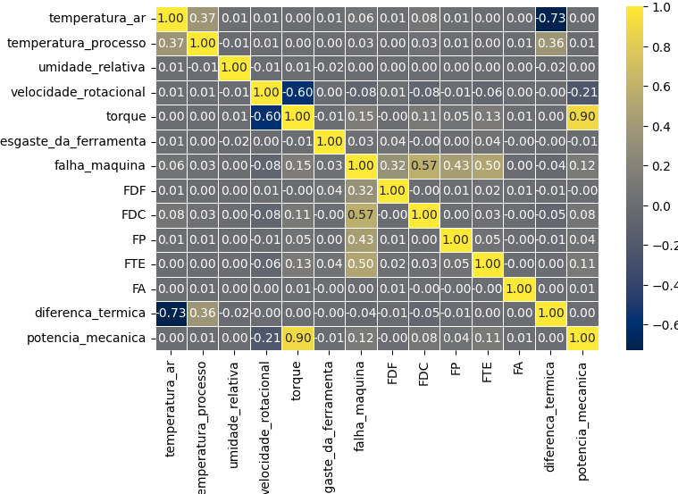
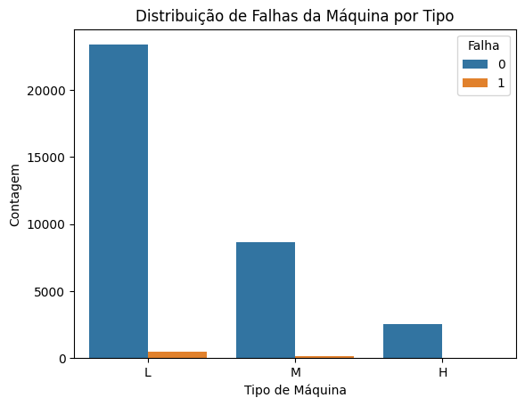
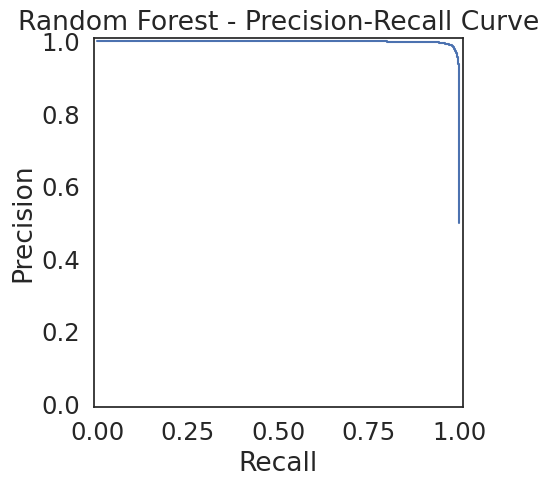
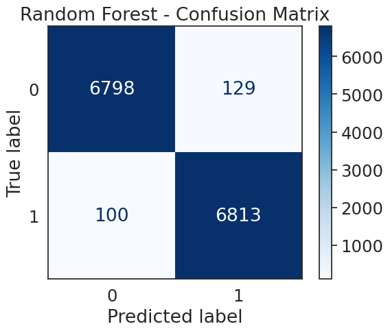
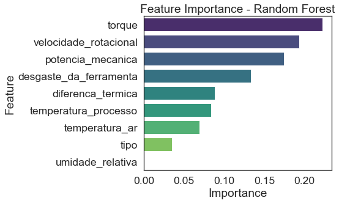

# 🔍 Análise Exploratória de Dados (EDA)

A etapa de **Análise Exploratória de Dados (EDA)** foi essencial para compreender a base utilizada no projeto de manutenção preditiva.  
O estudo revelou **padrões, relações entre variáveis e desafios importantes**, como o desbalanceamento das classes.

---

## 📊 Correlação entre Variáveis

Foi observado que algumas variáveis apresentam **forte correlação**, especialmente entre os atributos **mecânicos**:

- Torque e Velocidade Rotacional possuem alta dependência.  
- Potência Mecânica também acompanha essas variáveis, reforçando sua relevância no processo.  

  
*
Mapa de calor destacando as correlações entre variáveis numéricas.
*  

---

## ⚖️ Distribuição de Classes

Outro ponto crítico identificado foi o **desbalanceamento das classes**.  
A classe **"sem falha" (0)** representa a grande maioria dos registros, enquanto os casos de **"falha" (1)** são bem menos frequentes.

- Isso torna a modelagem mais desafiadora, pois modelos ingênuos tenderiam a prever apenas a classe majoritária.  
- Estratégias de **balanceamento** (como oversampling/undersampling ou ajustes de peso nas classes) se tornam necessárias para evitar viés.  

  
*
Distribuição de classes: predominância de registros "sem falha".
*  

---

###  ⚖️ Modelagem e Comparação de Desempenho

Três algoritmos de classificação foram testados: **Árvore de Decisão, Bagging e Random Forest**.  
Devido ao desbalanceamento, o **F1-Score** foi escolhido como métrica principal de avaliação.  

O modelo **Random Forest** apresentou o melhor desempenho geral, conforme ilustrado abaixo:  

  
*
Comparativo de métricas entre os modelos avaliados.
*  

| Modelo           | F1-Score (Falha) |
|------------------|------------------|
| 🌲 Random Forest | **0.9775**       |
| 🧩 Bagging       | 0.9722           |
| 🌳 Decision Tree | 0.9582           |

---

### 📊 Performance Detalhada do Modelo Campeão – Random Forest

- **Recall (Falha): 0.93** → o modelo identificou 93% das falhas reais.  
- **F1-Score geral: 0.98** → excelente equilíbrio entre precisão e recall.  
- **Baixa taxa de Falsos Negativos**, reduzindo riscos de falhas não previstas.  

  
*
Relatório de classificação detalhado.
*  

  
*
Matriz de confusão para o conjunto de teste.
*  

O **Random Forest** foi escolhido como modelo final por apresentar o melhor equilíbrio entre desempenho, robustez e interpretabilidade.  

---

### 🔎 Interpretabilidade do Modelo

A análise de **importância das variáveis** revelou que fatores **mecânicos e operacionais** são os principais preditores de falha.  

- **Mais relevantes**: Torque, Desgaste da Ferramenta, Velocidade Rotacional.  
- **Impacto moderado**: Diferença de Temperatura entre processo e ar.  
- **Menor impacto**: Variáveis ambientais (Temperatura do Ar, Umidade Relativa).  

  
*
Top 10 variáveis mais relevantes para o Random Forest.
*  

## ✅ Insights Gerais

1. **Variáveis Mecânicas** (torque, rotação, potência) são as que mais se relacionam com possíveis falhas.  
2. **Variáveis Ambientais** (temperatura do ar, umidade) apresentam impacto limitado, mas podem atuar como fatores secundários.  
3. **Desbalanceamento de Classes** exige atenção especial na escolha de métricas (F1-Score, Recall) e técnicas de modelagem.  
4. A base de dados mostra-se adequada para aplicação de **modelos supervisionados**, desde que o desbalanceamento seja tratado. 

### ✅ Conclusões e Próximos Passos

O modelo final se mostrou **altamente eficaz** na predição de falhas, atingindo um **F1-Score de 0.9775**.  
Sua implementação prática pode gerar impacto significativo, como:  

- 🚫 Redução de paradas não planejadas.  
- ⚡ Maior confiabilidade e segurança operacional.  
- 💰 Economia substancial em custos de manutenção.  

### 🔮 Próximos Passos
- 🌐 **Deploy do modelo** como API (FastAPI).  
- 📊 Criação de **dashboard interativo** com Streamlit para monitoramento em tempo real.  
- 🐳 Empacotamento com **Docker** para deploy em qualquer ambiente (cloud ou on-premise).
- 
 

---

📌 Essa análise inicial guiou a modelagem, ajudando a priorizar variáveis e selecionar métricas adequadas para o problema de manutenção preditiva.

